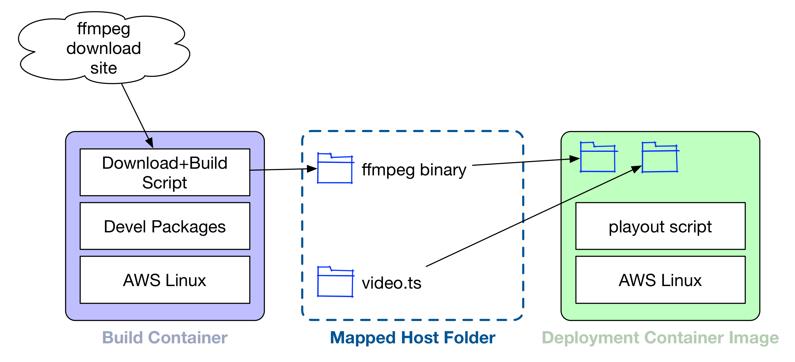

# Video Playout With Containers

## Background

In the interest of full disclosure: I write video software for Amazon Web Services. This project uses Amazon services to stream video. While many services offer free tiers that you can slide into for a time, most will eventually require real money to use.

In my duties as a video software engineer, I often need to get a “live” video stream to the cloud. In many real-world cases, this is done by connecting a camera (or whole production studio) to a video encoder that lightly compresses the video, then sends that compressed stream to the cloud. It's fairly easy to emulate that with a video loop and [ffmpeg](http://ffmpeg.org/) on your laptop, but if you close your laptop, it goes away. It's also easy to set up an EC2 instance and run ffmpeg in a `tmux` or `screen` session, but then you have a host to manage.

What I really want is a Docker container, with everything fully self-contained — ffmpeg plus a video file to loop — that I can just spin up and tear down with only a click or two. This is that project.

## Overview

The [ffmpeg_unicast_ecs](https://github.com/BrianEnigma/ffmpeg_unicast_ecs) project encapsulates ffmpeg and a playout video into a fully self-contained Docker image. It streams the looped video using UDP unicast to a destination (IP address and port) that you choose at runtime.

This project is copyright 2018 by Brian Enigma and licensed under a <a rel="license" href="http://creativecommons.org/licenses/by-sa/4.0/">Creative Commons Attribution-ShareAlike 4.0 International License</a>. You can use it for personal projects as well as commercially, as long as attribution is retained. Find it on GitHub: <https://github.com/BrianEnigma/ffmpeg_unicast_ecs>

## Prerequisites

Before you begin, there are a few prerequisites you'll need:

- The [Community Edition of Docker](https://www.docker.com/community-edition). You'll need this to build and run the toolchain container as well as to produce the deployment container.
- The [AWS CLI](https://aws.amazon.com/cli/). This gets used to push your deployment container to the Elastic Container Registry.
  - A profile defined in AWS CLI. `aws --profile MyProfile configure` will configure a profile named `MyProfile`.
- An [AWS Elastic Container Registry](https://aws.amazon.com/ecr/) set up.
  - Just use the web UI and create an empty registry. This project will push an image up there. I called mine `ffmpeg-unicast`. Take note of the URI of your registry and which region it's in.

## Configuration

Once you have these set up, you'll have to configure it. Duplicate `config-sample.mk` and rename it to `config.mk`. Use a text editor to enter your above information: your profile name, your registry URI and its region.

## Building the Image

Building the image is a three stage process:

Both stages are fully automated for you behind a single `make` command. First you'll build a docker image with a full AWS Linux base plus a bunch of build tools. Next, you'll execute that build container, using it to build ffmpeg against all the standard AWS Linux system libraries. Finally, you'll build a lightweight container of just a skeletal OS, ffmpeg, and your video.

I've provided a sample video with 30 seconds of colorbars and a burned-in timecode. Feel free to overwrite `video.ts` with a video of your choosing. It needs to be in a transport stream container.

To kick off the process, ensure the Docker service is running and that you have network connectivity so that the containers and ffmpeg source code can be downloaded. Then run:

`make package`

This will perform the above three stages. Creating the build container will take about 5 minutes. Building ffmpeg can take ~30 minutes. Packaging the deployment container takes a few minutes. So run off, find something to do, and return later.

## Pushing the Image

When the above has completed successfully, you can push it to your Elastic Container Registry:

`make push`

## Running the Image

(todo)

(todo)

## FAQ

**Q: Why do you waste space on putting the video in the container? Why not just load it from S3 or something?**

A: I wanted to keep things as easy and turnkey as possible. Putting all resources into the container image means that there is no special role or bucket configuration.